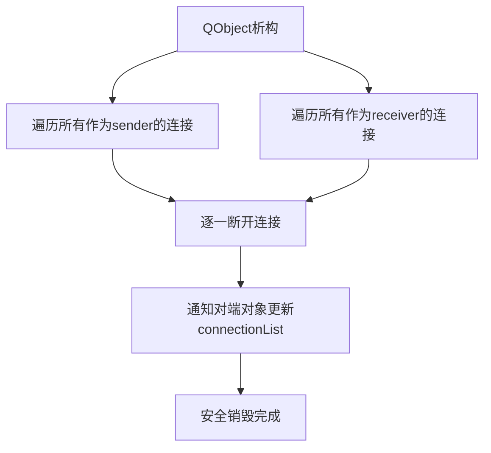

# 信号连接的对象被销毁了会怎样？如何防止内存泄漏？

## 知识点速览

Qt的QObject析构函数内置了**自动断开连接**机制：当一个QObject被销毁时，所有与它相关的信号槽连接都会被自动断开。



**三道防线：**

| 机制 | 作用 | 场景 |
|------|------|------|
| 自动断开 | QObject析构时自动断开所有连接 | 默认行为 |
| 父子对象树 | 父删子随，递归清理 | 窗口/控件层级管理 |
| QPointer | 弱引用，对象销毁后自动置nullptr | 需要保存QObject指针时 |

## 我的实战经历

**项目背景：** 在南京华乘电气T95带电检测手持终端项目中，设备管理是核心模块。终端可以动态连接和断开多种检测设备（TEV/UHF传感器等），每种设备对应一个QObject派生的设备对象。

**遇到的问题：** 设备是动态热插拔的——用户可能随时连接或拔出设备。早期实现有两个问题：
1. **忘记断开连接**：设备拔出后没有disconnect就delete，告警模块还在尝试访问设备属性，偶发崩溃
2. **内存泄漏**：设备对象创建时new若干子对象，移除时只delete设备对象，子对象泄漏

**分析与解决：**

第一，利用Qt的自动断开机制和setParent建立父子关系：

```cpp
class DetectionDevice : public QObject {
    Q_OBJECT
public:
    explicit DetectionDevice(const QString& portName, QObject* parent = nullptr)
        : QObject(parent), m_portName(portName) {
        m_dataBuffer = new DataBuffer(this);        // parent = this
        m_protocolParser = new ProtocolParser(this); // parent = this
        m_signalProcessor = new SignalProcessor(this);
        connect(m_protocolParser, &ProtocolParser::frameReady,
                m_signalProcessor, &SignalProcessor::processFrame);
        connect(m_signalProcessor, &SignalProcessor::dataReady,
                this, &DetectionDevice::dataReady);
    }
signals:
    void dataReady(const DetectionData& data);
    void statusChanged(DeviceStatus status);
};
```

第二，设备管理器用setParent统一管理：

```cpp
class DeviceManager : public QObject {
    Q_OBJECT
public:
    void addDevice(const QString& portName) {
        auto* device = new DetectionDevice(portName, this);
        m_devices[portName] = device;
        connect(device, &DetectionDevice::dataReady,
                m_waveformWidget, &WaveformWidget::updateWaveform);
        connect(device, &DetectionDevice::statusChanged,
                m_alarmManager, &AlarmManager::onDeviceStatusChanged);
    }
    void removeDevice(const QString& portName) {
        if (auto* dev = m_devices.take(portName))
            dev->deleteLater();  // 安全删除
    }
};
```

第三，告警模块用QPointer防止悬空指针：

```cpp
class AlarmManager : public QObject {
    Q_OBJECT
public:
    void monitorDevice(DetectionDevice* device) {
        m_monitoredDevice = QPointer<DetectionDevice>(device);
    }
    void checkAlarm() {
        if (m_monitoredDevice) {  // 自动检查是否存活
            auto data = m_monitoredDevice->lastData();
        }
    }
private:
    QPointer<DetectionDevice> m_monitoredDevice;
};
```

**结果：** 重构后再也没出现设备拔出导致的崩溃或内存泄漏。设备管理器销毁时所有设备对象和子对象自动递归清理。

## 深入原理

### deleteLater vs delete

| 方式 | 执行时机 | 适用场景 |
|------|---------|---------|
| `delete obj` | 立即销毁 | 确定没有在当前调用栈中 |
| `obj->deleteLater()` | 下一次事件循环 | 在槽函数中删除sender/receiver |

### Lambda连接的特殊问题

```cpp
// 危险：没有指定receiver
connect(timer, &QTimer::timeout, [device]() {
    device->doSomething();  // device可能已delete
});
// 安全：指定device为receiver
connect(timer, &QTimer::timeout, device, [device]() {
    device->doSomething();  // device销毁时连接自动断开
});
```

### QPointer vs QSharedPointer

| 类型 | 机制 | 用途 |
|------|------|------|
| QPointer | 弱引用 | 观察QObject是否还活着 |
| QSharedPointer | 强引用计数 | 共享所有权 |
| QWeakPointer | 配合Shared的弱引用 | 打破循环引用 |

### 常见陷阱

1. **在析构函数中emit信号**：此时子对象可能已销毁
2. **跨线程deleteLater**：需要目标线程有事件循环
3. **对象树和堆栈混用**：栈上的子对象会被父对象double-free
4. **忘记setParent**：new出的QObject不设parent不会被自动管理

## 面试表达建议

**开头：** "QObject被销毁时，Qt自动断开该对象所有信号槽连接。配合父子对象树和QPointer，可以构建完整的生命周期安全机制。"

**重点展开：** 用T95设备管理器的故事——设备热插拔，setParent建立父子关系让子对象自动清理，deleteLater安全删除，QPointer防止悬空指针。

**收尾：** "我的经验是：能用父子关系的就setParent，需要延迟销毁的用deleteLater，持有QObject指针的地方用QPointer。Lambda连接一定指定receiver。"