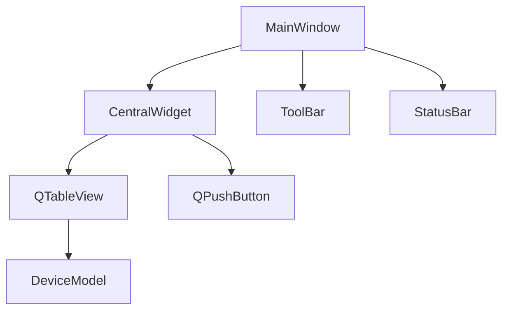
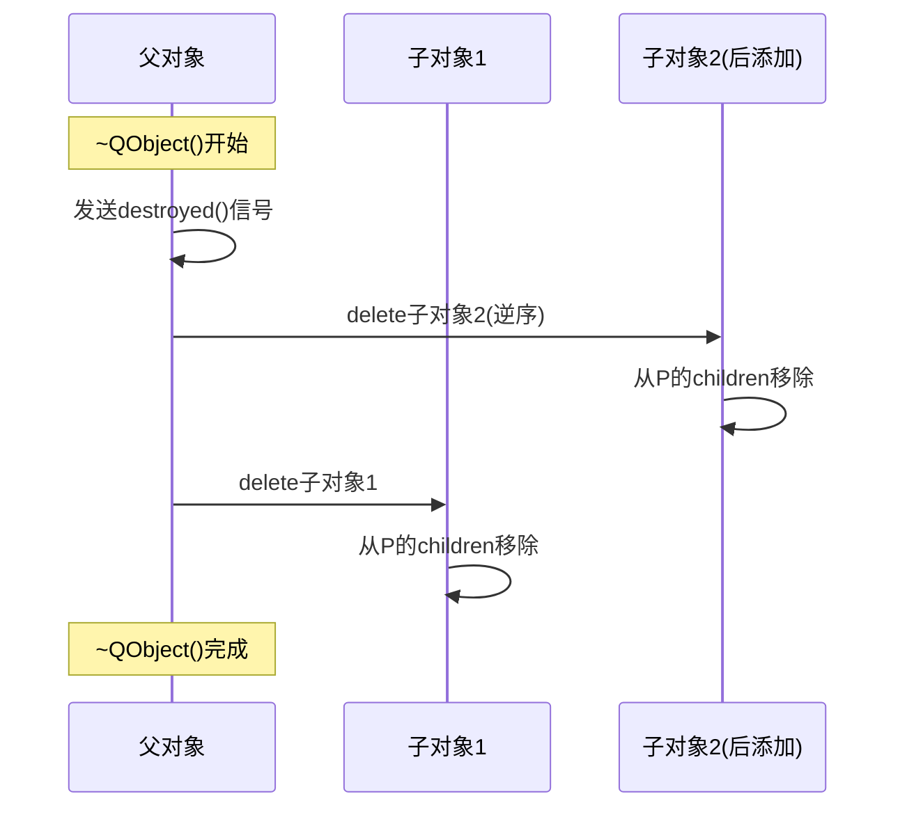

# Qt的对象树机制及内存管理方式是什么？

## 知识点速览

Qt的对象树(Object Tree)是QObject的内置特性，实现了**层级式自动内存管理**——父对象销毁时递归删除所有子对象。



> 当MainWindow关闭并销毁时，整棵树的所有对象自动递归删除，无需一行delete代码。

**核心规则：**

| 规则 | 说明 |
|------|------|
| 父删子随 | 父对象析构时自动delete所有子对象 |
| 递归清理 | 子对象的子对象也会被递归删除 |
| 逆序析构 | 子对象按添加的逆序析构 |
| 自动脱离 | 子对象先于父对象销毁时，自动从children列表移除 |

## 我的实战经历

**项目背景：** 在南京华乘电气T95带电检测手持终端项目中，主界面是一个复杂窗口——顶部工具栏、左侧设备列表、中间波形显示区、底部状态栏，还有各种弹窗对话框。

**遇到的问题：** 项目初期，一位同事创建动态子窗口时没有设置parent：

```cpp
// 有问题的写法
void MainWindow::showDetailWindow(const DetectionData& data) {
    auto* detailWin = new DetailWindow();  // 没有parent!
    detailWin->setData(data);
    detailWin->show();
    // 用户关闭后对象不会被delete -> 内存泄漏
}
```

每次点击"查看详情"都泄漏一个窗口对象。运行几小时后内存从50MB涨到200MB+，嵌入式设备最终OOM崩溃。

另一个问题是栈上创建子Widget：

```cpp
void SomeWidget::init() {
    QLabel label("Status:", this);  // 栈上创建，parent=this
    // 函数返回后label析构
    // 之后this析构时又delete &label -> 双重析构 -> 崩溃
}
```

**分析与解决：**

**规则一：动态窗口必须设parent或WA_DeleteOnClose：**

```cpp
void MainWindow::showDetailWindow(const DetectionData& data) {
    // 方案1：设置parent
    auto* detailWin = new DetailWindow(this);
    detailWin->setData(data);
    detailWin->show();

    // 方案2：独立窗口用WA_DeleteOnClose
    auto* floatingWin = new DetailWindow();
    floatingWin->setAttribute(Qt::WA_DeleteOnClose);
    floatingWin->show();
}
```

**规则二：利用对象树管理组件层级：**

```cpp
MainWindow::MainWindow(QWidget* parent) : QMainWindow(parent) {
    auto* central = new QWidget(this);
    setCentralWidget(central);
    auto* layout = new QVBoxLayout(central);
    m_waveformWidget = new WaveformWidget(central);
    m_deviceTable = new QTableView(central);
    m_statusBar = new DeviceStatusBar(this);
    layout->addWidget(m_waveformWidget);
    layout->addWidget(m_deviceTable);
    setStatusBar(m_statusBar);
    m_deviceManager = new DeviceManager(this);
    // MainWindow关闭 -> 自动清理全部
}
```

**规则三：QObject子类在堆上创建，不在栈上创建带parent的对象。**

**结果：** 规范实施后内存泄漏完全消失。程序连续运行24小时测试，内存稳定在60MB不增长。

## 深入原理

### 对象树的内部实现



### 对象树 vs 智能指针

| 特性 | 对象树 | unique_ptr/shared_ptr |
|------|--------|----------------------|
| 适用范围 | QObject派生类 | 任意C++对象 |
| 所有权 | 父对象独占 | unique独占/shared共享 |
| 循环引用 | 不可能(树结构) | shared_ptr可能 |
| 与信号槽配合 | 完美 | 需要额外注意 |

### findChildren()：遍历对象树

```cpp
auto buttons = mainWindow->findChildren<QPushButton*>();
auto* saveBtn = mainWindow->findChild<QPushButton*>("saveButton");
```

### 常见陷阱

1. **栈上创建带parent的对象**：双重析构崩溃
2. **delete子对象后delete父对象**：不会出问题！子对象析构时从children移除自己
3. **在非GUI线程创建QWidget**：QWidget只能在主线程创建和销毁
4. **moveToThread要求无parent**：有parent不能移动线程
5. **对象树和容器混用**：qDeleteAll+对象树=双重析构

## 面试表达建议

**开头：** "Qt的对象树是QObject内置的层级关系管理——父对象删除时自动递归删除所有子对象。"

**重点展开：** 用T95项目经验：动态子窗口不设parent导致内存泄漏（50MB涨到200MB），栈上创建子对象导致双重析构。解决后24小时内存稳定60MB。

**收尾：** "QObject派生类用对象树管理，非QObject用智能指针，两套机制分工明确。规则很简单——new的时候传parent，让Qt帮你管内存。"