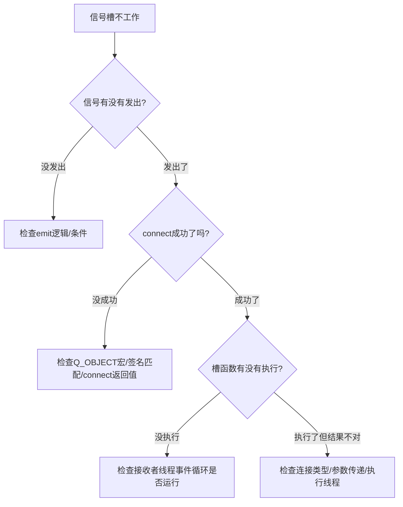

# 调试信号槽问题有什么实用技巧？

## 知识点速览

信号槽问题是Qt开发中最隐蔽的一类bug——连接失败只有运行时warning，跨线程时序问题难以复现，事件循环缺失导致槽函数"默默不执行"。



**六大调试工具/技巧：**

| 工具/技巧 | 作用 | 适用场景 |
|-----------|------|---------|
| QSignalSpy | 监听信号触发次数和参数 | 单元测试 |
| connect返回值 | 判断连接是否成功 | 运行时检查 |
| Lambda插桩 | 在信号路径中加日志 | 快速定位 |
| QT_FATAL_WARNINGS | warning变致命错误 | 开发阶段 |
| dumpObjectInfo() | 打印连接信息 | 运行时诊断 |
| 检查事件循环 | 确认Queued连接前提 | 跨线程场景 |

## 我的实战经历

**项目背景：** 在南京华乘电气T95项目中，最深刻的一次调试经历是跨线程信号槽"默默不执行"的问题。

**遇到的问题：** 新增UHF采集模块，Worker线程通过信号发频谱数据给UI线程。代码看起来完全正确，connect也写对了，但频谱控件就是不刷新——没有报错，没有warning。

```cpp
QThread* uhfThread = new QThread;
UHFWorker* uhfWorker = new UHFWorker;
uhfWorker->moveToThread(uhfThread);
connect(uhfWorker, &UHFWorker::spectrumReady,
        spectrumWidget, &SpectrumWidget::updateSpectrum);
uhfThread->start();
emit startAcquisition();
```

**排查过程：**

**第一步：确认信号是否发出。** Lambda插桩日志：

```cpp
connect(uhfWorker, &UHFWorker::spectrumReady,
        this, [](const QVector<float>& data) {
    qDebug() << "spectrumReady emitted, size:" << data.size();
});
```

结果：Lambda也没执行。说明信号根本没发出来。

**第二步：检查Worker内部。** 加日志发现startAcquisition槽函数也没执行。Worker的槽函数在工作线程中不被调用。

**第三步：检查事件循环。** Worker的槽函数需要工作线程有事件循环。检查代码发现问题：

```cpp
// 同事写的自定义QThread子类
class UHFThread : public QThread {
protected:
    void run() override {
        initHardware();
        // 忘记调exec()！没有事件循环！
    }
};
```

没有exec()就没有事件循环，Queued连接投递的事件永远不会被处理。

**解决方案：** 改为标准Worker+QThread模式：

```cpp
QThread* uhfThread = new QThread;  // 标准QThread，不继承
UHFWorker* uhfWorker = new UHFWorker;
uhfWorker->moveToThread(uhfThread);
connect(uhfThread, &QThread::started,
        uhfWorker, &UHFWorker::initialize);
uhfThread->start();  // start() -> run() -> exec() -> 事件循环运行
```

**事后总结：** 我整理了排查检查清单：

```
信号槽故障排查清单：
- Q_OBJECT宏是否存在？
- connect返回值是否有效？
- 信号是否真的emit了？（Lambda插桩验证）
- 连接类型是否正确？
- 接收者线程是否有事件循环？（exec()是否被调用）
- 自定义类型是否qRegisterMetaType？
- 对象是否在connect之前就被销毁了？
```

**结果：** 后来团队再遇到信号槽问题，按清单排查基本10分钟内就能定位。

## 深入原理

### QSignalSpy的使用

```cpp
#include <QSignalSpy>
QSignalSpy spy(worker, &UHFWorker::spectrumReady);
worker->processData(testData);
QCOMPARE(spy.count(), 1);
QList<QVariant> args = spy.takeFirst();
QVector<float> spectrum = args.at(0).value<QVector<float>>();
QCOMPARE(spectrum.size(), 1024);
```

### connect返回值检查

```cpp
QMetaObject::Connection conn = connect(sender, &Sender::sig,
                                        receiver, &Receiver::slot);
if (!conn) qWarning() << "connect failed!";
```

### dumpObjectInfo()和dumpObjectTree()

```cpp
myObject->dumpObjectInfo();
// 输出信号槽连接信息
mainWindow->dumpObjectTree();
// 输出对象树层级
```

### 常见信号槽故障模式

| 症状 | 常见原因 | 排查方法 |
|------|---------|---------|
| 槽函数不执行，无提示 | 接收者线程无事件循环 | 检查exec() |
| 运行时warning: No such signal/slot | 旧宏拼写错误 | 改用函数指针写法 |
| 槽函数执行但崩溃 | 跨线程直接操作UI | 检查连接类型 |
| 信号连接后多次触发 | 重复connect | 用UniqueConnection |
| 自定义类型Queued连接失败 | 未注册元类型 | qRegisterMetaType |

### 高级调试

```cpp
// 启用Qt内部调试日志
QLoggingCategory::setFilterRules("qt.core.qobject.connect=true");
```

## 面试表达建议

**开头：** "调试信号槽我有一套系统化方法，核心是沿着信号传播路径逐步排查——信号发出了吗？连接成功了吗？槽函数执行了吗？执行线程对吗？"

**重点展开：** 讲T95项目UHF模块排查过程：Lambda插桩发现信号没发出，查Worker发现槽函数没执行，最后定位到QThread子类重写run()没调exec()。

**收尾：** "这次经历后我整理了排查清单——Q_OBJECT宏、connect返回值、信号发射验证、事件循环检查、元类型注册。按清单排查，基本10分钟内就能定位。另外开发阶段习惯开QT_FATAL_WARNINGS。"